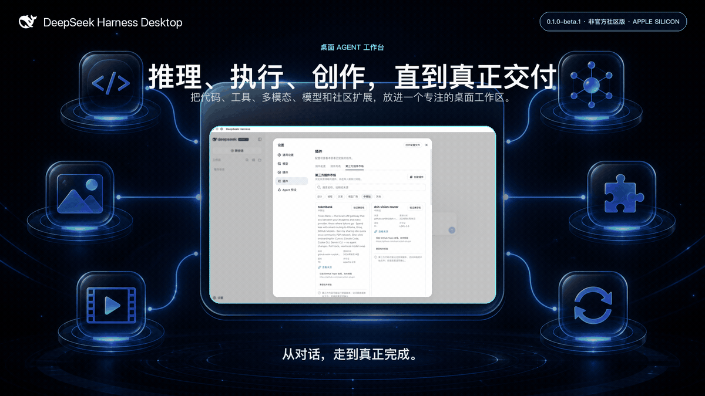
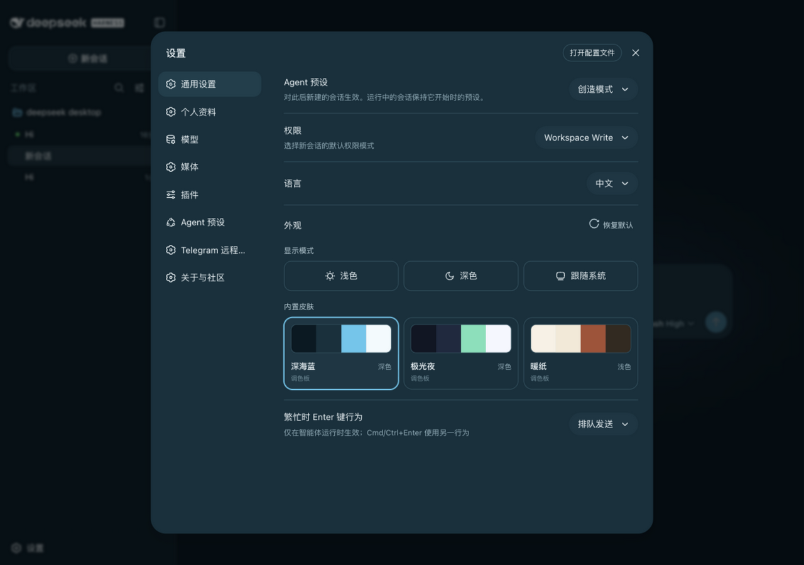
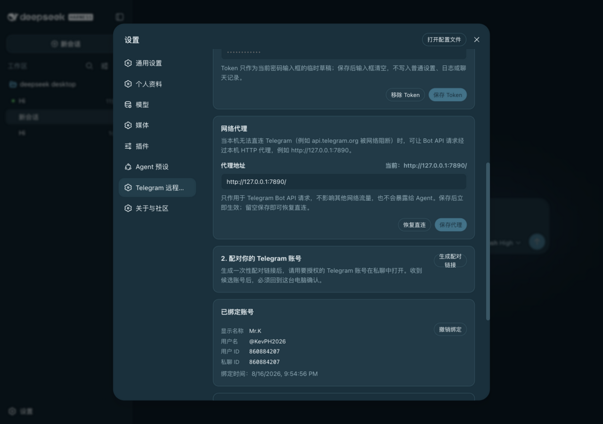
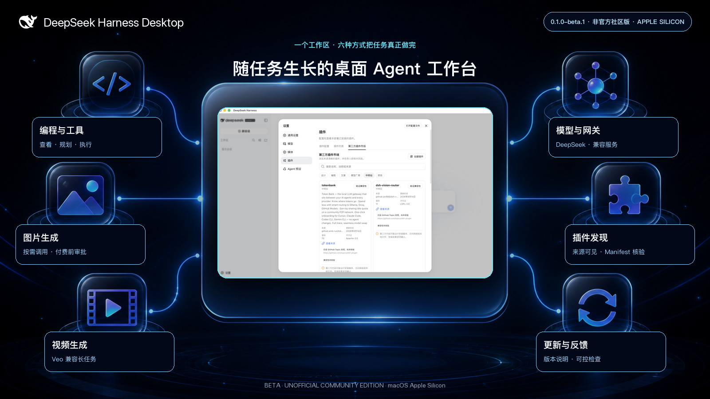

<p align="center">
  
</p>

# DeepSeek Harness Desktop

**中文** | [English](README.en.md)

<p align="center"><strong>一个支持编程、工具、多模态生成，还能通过 Telegram 在手机上继续研究和写作任务的桌面 agent 工作区。</strong></p>

<p align="center">
  <a href="https://github.com/KevPH2026/deepseek-harness-desktop/releases"></a>
  <a href="LICENSE"></a>
  <a href="https://github.com/KevPH2026/deepseek-harness-desktop/stargazers"></a>
  
</p>



> [!TIP]
>
> 🌐 产品主页：**[deepseeklab.org](https://deepseeklab.org)** —— 功能导览、皮肤展示与微信用户群（二维码见下方社区区）。

<table>
  <tr>
    <td width="50%"></td>
    <td width="50%"></td>
  </tr>
</table>

> [!IMPORTANT]
>
> DeepSeek Harness Desktop 是由 [@KevPH2026](https://github.com/KevPH2026) 维护的**非官方社区版**。它基于开源 [DeepSeek Harness](https://github.com/deepseek-ai/deepseek-harness) 项目，不是 DeepSeek 官方桌面产品，也不代表官方背书。

## 一个工作区，更多完成任务的方式

DeepSeek Harness 已经提供了强大的插件化 agent harness（智能体框架）。本社区版把它带进受监管的 macOS 桌面应用，并加入更适合日常使用的产品功能：可配置的图片与视频生成、经过电脑确认的 Telegram 手机控制、展示来源与按需 manifest 核验状态的社区插件目录、面向版本发布的更新机制、版本说明和直接反馈入口。

| 你可以做什么 | 桌面版如何提供帮助 |
|---|---|
| 构建和修改软件 | 为 agent 指定工作区，让它检查文件、运行工具、规划改动，并把会话集中保留。 |
| 制作视觉交付物 | 一次配置图片和视频提供方；当交付物确实需要视觉内容时，agent 可以调用合适的媒体工具。 |
| 在手机上继续研究和写作 | 在电脑上绑定一个 Telegram 私聊账号，Mac 保持在线后即可发送文字任务，并在同一聊天里收到安全 Agent 的最终回复。 |
| 扩展不同工作流 | 按场景发现社区插件、检查信任信息，并按需验证单个仓库；当前源码 Beta 尚未开放安装。 |
| 接入自己的模型体系 | 使用 DeepSeek、受支持的兼容提供方或网关，桌面外壳不会绑定单一推理后端。 |
| 持续保持更新 | 在应用内阅读版本说明、检查已签名的 GitHub Release，并自行决定何时下载与安装。 |



## 亮点功能

### 原生桌面工作流

- 围绕完整 Harness Web 工作区构建的专注型 Electron 桌面外壳。
- 在随机 `127.0.0.1` 端口运行一个受监管 Harness 进程，明确退出时有时限地清理完整进程树。
- 渲染器默认采用严格安全设置：关闭 Node 集成、开启上下文隔离和 Chromium 沙箱，并把导航锁定到当前本机来源。
- 使用桌面应用专属数据目录，提供应用日志、原生菜单、作者信息、版本说明、更新检查和反馈入口。

### 智能图片与视频生成

- 通过 OpenAI Images 兼容提供方执行 `generate_image`，初始默认模型为 `gpt-image-2`。
- 通过 Google Veo 兼容提供方执行 `generate_video`，初始默认模型为 `veo-3.1-generate-preview`。
- 媒体工具在完成配置前保持关闭，默认采用“付费前审批”。
- 只有当媒体内容能改善用户要求的交付物时，agent 才会选择媒体工具；普通编程和写作任务仍以文本为主。
- 生成产物会以专用结果卡片展示，并在会话中持续可用。

### Telegram 手机控制

- 接入一个专用 Telegram Bot，在电脑上生成十分钟内单次有效的绑定链接，再核对并确认准确的 Telegram 用户数字 ID 和私聊数字 ID。
- 直接发送文字即可新建或继续 Agent 会话；也可以用 `/new`、`/sessions`、`/use`、`/status`、`/stop` 和 `/help` 明确控制。
- 每条已接受消息都会先持久记录并去重，再推进 Telegram 更新位置；Agent 完成后会把最终回复发回绑定聊天。
- 已完成回复会进入持久待发队列：临时投递故障会持续退避补发，但不会重跑任务；更换 Bot 或回复超过三个消息分段时，该次投递会永久停止。如果 Telegram 已接收消息，而本地标记尚未保存时应用崩溃，恢复后可能重复发送一条消息。
- Mac 仍然只监听 `127.0.0.1`。Telegram 采用电脑主动发起的长轮询，不会把 Harness Web API 变成公网服务。
- 手机任务使用独立的 `telegram-safe` Agent 预设，只提供文字推理与 `web_search`。本地文件、Shell、代码执行、凭据、设置、审批、付费媒体工具、子代理、工作流和原始 RPC 均不可用。
- 单调执行 Guard 会持续守住这条能力边界；即使其他 Host 插件之后注册新工具，也无法由 Telegram 任务调用。Telegram 不能修改预设或权限。

### 一键安装的精选社区增强包

- 插件市场内置精选全家桶，来自 **@linxin666** 的 [dsh-web-ui](https://github.com/zhu1090093659/dsh-web-ui)（Apache-2.0）：Git 图谱、右侧文件/变更面板、皮肤中心（含多款皮肤）、图像理解、梁神模式预设和鲸鱼娘桌面宠物。
- 在明确的风险确认后，通过官方 profile 机制一键安装、一键卸载。SSH 运维、任务看板、社区插件中心、移动端远程与实时令牌估算被刻意排除；任意市场插件的安装路径保持默认关闭。

### 可点击的用量面板

- 输入框下方统计条可点击展开完整用量面板：未缓存输入、缓存读取、缓存写入、输出、计费输入合计、总 Token、缓存命中率、上下文占用与速度指标 —— 全部来自提供商上报的持久账目，不做估算。

### 社区插件市场

- 从 [`dsh-plugin`](https://github.com/topics/dsh-plugin) 话题发现仓库；只有在固定提交上的 manifest 与 patch 目标验证通过后，才把所选项目标为兼容，兼容不代表已开放安装。
- 按设计、编程、文案、模型提供方、网关和其他工作流组织插件。
- 可填写 GitHub、npm 或本地路径来源草稿并查看相应风险；当前 Beta 不执行导入，同时提供创建与发布插件的引导入口。
- 在安装保持关闭时展示源码、许可证、版本、更新时间、验证状态和风险信息。加入话题本身不会被当作兼容性或可信度证明。

### 提供方优惠，不虚构赞助关系

- 只有同时具备资格条件、条款、来源链接和核验日期时，提供方专区才会列出公开免费额度或试用优惠。
- 社区合作伙伴与普通提供方优惠会被分别标注。
- 没有真实且经过核验的关系，就不会把任何提供方描述为赞助商或合作伙伴。

## 开始使用

### 直接下载安装

前往 [Releases 页面](https://github.com/KevPH2026/deepseek-harness-desktop/releases)，下载对应 macOS Apple Silicon 的 `DeepSeek-Harness-Desktop-*-arm64.dmg` 或同名 `.zip`，双击按提示拖进「应用程序」即可。首次打开时若 macOS 提示「无法验证开发者」，二选一处理一次即可：

```sh
# 方法 A：右键点击 .app → 打开 → 在弹窗里再次点「打开」
# 方法 B：终端一行命令绕过 Gatekeeper
xattr -cr "/Applications/DeepSeek Harness Desktop.app"
```


### 应用内更新通道

应用只检查这一发布渠道，不会跟随任意仓库提交；新版本发布时菜单会在下载或安装前征求用户确认。

<a id="从源码运行"></a>

### 从源码运行

前置条件：Apple Silicon Mac、Node.js `^22.19.0 || >=24.0.0`、pnpm，以及一个模型提供方 API Key。

```sh
pnpm install
pnpm setup:skins    # 一键安装 10 款社区皮肤、鲸鱼娘宠物、皮肤中心等精选增强
pnpm run desktop:dev
```

`pnpm setup:skins` 是幂等的：第二次运行不会重复执行 `dsh plugin add`，profile 已是最新时会直接跳过。

### 一键复现社区皮肤

发布版只内置 3 套官方皮肤(深海蓝/极光夜/暖纸)和 1 个官方宠物位。要看到 [Releases 页面](https://github.com/KevPH2026/deepseek-harness-desktop/releases) 上展示的 10 款社区皮肤 + 鲸鱼娘桌面宠物，在装好 GitHub Release 之后跑：

```sh
# 解包后:
hdiutil attach DeepSeek-Harness-Desktop-0.1.0-beta.3-arm64.dmg
sudo cp -R "/Volumes/DeepSeek Harness Desktop/DeepSeek Harness Desktop.app" /Applications/

# 首次启动 + 一次 Configure later 之后, 在仓库根:
pnpm install
pnpm setup:skins
# 重启应用后, 设置 → 外观 → Skin Center 即会显示 10 款社区皮肤
```

这一步只动你本机的 `~/Library/Application Support/DeepSeek Harness Desktop/harness/profiles/web/`,不会向其他用户写入任何东西,也不会修改源码。

```sh
git clone https://github.com/KevPH2026/deepseek-harness-desktop.git
cd deepseek-harness-desktop
pnpm install
npm run desktop:dev
```

创建本地未签名验证版本：

```sh
npm run desktop:pack:mac
```

分发应用包前，请先阅读[桌面构建与安全指南](apps/desktop/README.md)。

## 信任与费用边界

- **插件会执行代码。** 后续版本开放安装时，安装 Git 源可能在 agent 沙箱之外运行包构建脚本。请先检查源码、固定提交版本，并且只为你信任的代码批准构建脚本。当前源码 Beta 的市场安装保持关闭。
- **回环地址是本机通信，不代表保密。** 第一版桌面传输会信任同一登录用户下运行的其他原生进程。不要让敏感会话与不受信任的本机软件同时运行。
- **媒体调用可能产生费用。** 默认审批策略会在生成前询问。价格、资格和速率限制由对应提供方负责。
- **Telegram Bot 聊天没有端到端加密。** Telegram 能够处理发送给 Bot 的消息，每条接纳任务也可能消耗模型或搜索额度。请使用专用 Bot，不要发送密码或 API Key；需要远程工作时让 Mac 和托盘进程保持在线。通道停用期间，消息不会执行。如果 Telegram 报告仍有积压更新，客户端会保持停用，既不读取，也不确认或清空这些消息；可以等待 Telegram 在最长 24 小时的保留期内让它们过期，也可以撤销绑定、移除 Token，再绑定一个新的专用 Bot。
- **只有已签名 Release 才会自动更新。** 本地未签名版本可以检查更新，但会安全失败，不会绕过 macOS 信任保护。

## 产品文档

- [产品介绍与文档站](docs/user/index.md)
- [Web 工作区快速入门](docs/user/guide/index.md)
- [模型提供方配置](docs/user/guide/providers.md)
- [插件开发与发布](docs/user/develop/basic/publish.md)
- [桌面构建、生命周期与安全](apps/desktop/README.md)

## 反馈与社区

- 🌐 完整功能导览的产品主页：[deepseeklab.org](https://deepseeklab.org)
- 💬 微信用户群（扫码加入，新版本与使用技巧第一时间发布）：

  

- 遇到 Bug 或有功能建议？[创建反馈 Issue](https://github.com/KevPH2026/deepseek-harness-desktop/issues/new/choose)。
- 正在开发 Harness 插件？请添加 [`dsh-plugin`](https://github.com/topics/dsh-plugin) 话题，并遵循[插件发布指南](docs/user/develop/basic/publish.md)。
- 希望展示提供方优惠或讨论真实合作？仓库上线后，请使用专门的提供方申请模板。
- 与上游 Harness 相关的问题和贡献请提交到 [DeepSeek Harness 仓库](https://github.com/deepseek-ai/deepseek-harness)。

## 项目状态

桌面版处于 Beta 阶段，上游 Harness 仍处于开发者预览阶段，可能出现破坏兼容性的变更。首个打包目标是 Apple Silicon Mac；其他平台需要完成独立打包和运行时验证后才会被列为受支持平台。

## 归属与许可证

精选社区增强包集成自 **@zhu1090093659（@linxin666）** 的 [dsh-web-ui](https://github.com/zhu1090093659/dsh-web-ui)（Apache-2.0）—— 特别感谢作者带来的优秀插件合集。

DeepSeek Harness 保留原始 `Copyright (c) 2026 DeepSeek` 版权声明。桌面封装与社区功能由 [@KevPH2026](https://github.com/KevPH2026) 维护，并按照上游 [MIT 许可证](LICENSE)分发。捆绑依赖的许可证见[第三方声明](THIRD_PARTY_NOTICES.md)。

如果这个项目帮助你把更多 agent 运行变成真正完成的工作，请为仓库 **Star**、分享你的作品，并一起建设社区插件生态。
