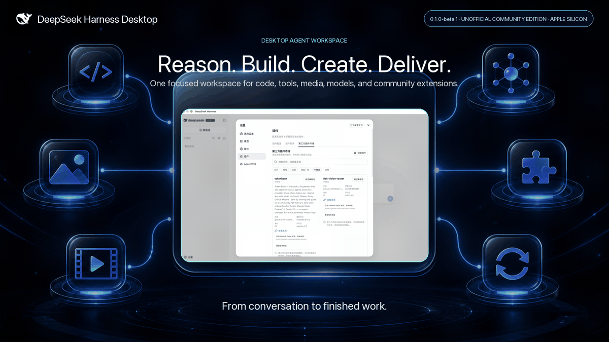
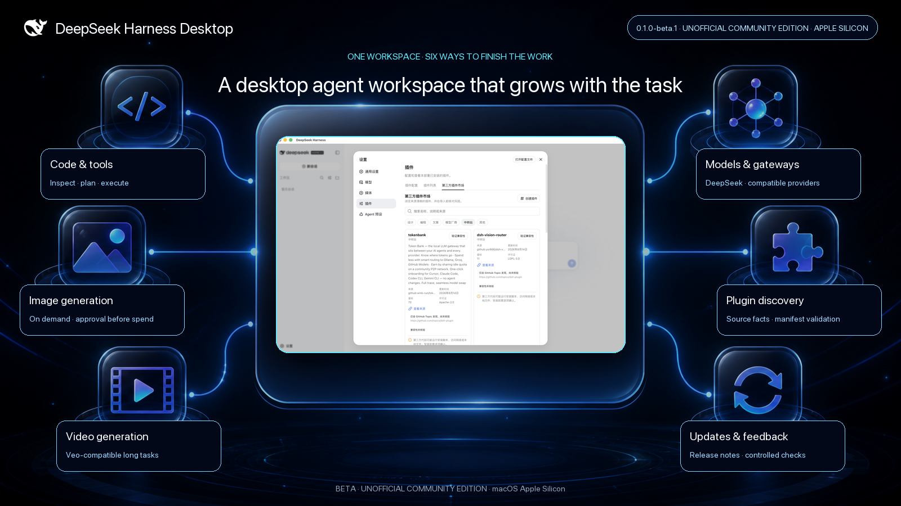

<p align="center">
  
</p>

# DeepSeek Harness Desktop

English | [中文](README.zh.md)

<p align="center"><strong>A desktop agent workspace for coding, tools, media generation, and safe research or writing tasks from a paired Telegram account.</strong></p>

<p align="center">
  <a href="https://github.com/KevPH2026/deepseek-harness-desktop/releases"></a>
  <a href="LICENSE"></a>
  <a href="https://github.com/KevPH2026/deepseek-harness-desktop/stargazers"></a>
  
</p>



> [!IMPORTANT]
>
> DeepSeek Harness Desktop is an **unofficial community edition** maintained by [@KevPH2026](https://github.com/KevPH2026). It is based on the open-source [DeepSeek Harness](https://github.com/deepseek-ai/deepseek-harness) project and is not an official DeepSeek desktop product or endorsement.

## One workspace, more ways to finish the job

DeepSeek Harness already provides a capable plugin-based agent harness. This community edition brings it into a supervised macOS desktop app and adds the product surfaces that make it easier to use every day: configurable image and video generation, a paired Telegram control channel, a source-aware community plugin catalog with on-demand manifest validation, release-aware updates, version notes, and a direct feedback path.

| What you can do | How the desktop edition helps |
|---|---|
| Build and change software | Give the agent a workspace, let it inspect files, run tools, plan changes, and keep sessions together. |
| Create visual deliverables | Configure image and video providers once; the agent can request the right media tool when the deliverable genuinely needs it. |
| Continue research and writing from your phone | Pair one private Telegram account on the desktop, send a text task while the Mac stays online, and receive the safe Agent's final response in the same chat. |
| Extend for your workflow | Discover community plugins by scenario, inspect trust signals, and validate one selected repository at a time; installation remains disabled in the source beta. |
| Connect your model stack | Use DeepSeek and supported compatible providers or gateways without coupling the desktop shell to one inference backend. |
| Stay current | Read release notes in the app, check signed GitHub Releases, and choose when to download and install an update. |



## Highlights

### Native desktop workflow

- A focused Electron shell around the complete Harness Web workspace.
- One supervised Harness process on a random `127.0.0.1` port, with bounded process-tree shutdown on Quit.
- Hardened renderer defaults: Node integration off, context isolation on, Chromium sandbox on, and navigation locked to the active local origin.
- Desktop-owned data directory, application logs, native menus, About information, release notes, update checks, and feedback links.

### Smart image and video generation

- `generate_image` through an OpenAI Images-compatible provider, with `gpt-image-2` as the initial model default.
- `generate_video` through a Google Veo-compatible provider, with `veo-3.1-generate-preview` as the initial model default.
- Media tools are disabled until configured and use approval-before-spend by default.
- The agent chooses media tools only when they improve the requested deliverable; ordinary coding and writing tasks stay text-first.
- Generated artifacts render as first-class result cards and remain available in the session.

### Telegram phone control

- Connect a dedicated Telegram Bot, generate a ten-minute single-use link, and approve the exact Telegram user and private-chat IDs on the desktop.
- Send ordinary text to start or continue an Agent session; use `/new`, `/sessions`, `/use`, `/status`, `/stop`, and `/help` for explicit control.
- Every accepted message is durably recorded and deduplicated before Telegram advances its update offset. The final Agent response returns to the bound chat.
- Finished replies wait in a durable outbox: temporary delivery failures retry with backoff without rerunning the task, while changing the Bot or exceeding three message parts permanently ends that delivery. A crash after Telegram accepts a message but before the local marker is saved can repeat one message.
- The Mac stays on `127.0.0.1`: Telegram uses outbound long polling and never turns the Harness Web API into a public server.
- Phone tasks use the dedicated `telegram-safe` Agent preset: plain-text reasoning and `web_search` only. Local files, Shell, code execution, credentials, settings, approvals, paid media tools, subagents, workflows, and raw RPC are unavailable.
- A monotonic execution guard enforces that capability boundary even if another Host plugin later registers a new tool. Telegram cannot change the preset or permission.

### Community plugin marketplace

- Discovers repositories from the [`dsh-plugin`](https://github.com/topics/dsh-plugin) topic and only labels a selected item compatible after its pinned manifest and patch target validate; compatibility does not enable installation.
- Organizes plugins for design, programming, writing, model providers, gateways, and other workflows.
- Accepts GitHub, npm, or local-path source drafts and shows the risks those sources would carry; the beta does not execute imports. A guided create-and-publish path is available.
- Shows source, license, revision, freshness, validation, and risk information while installation remains disabled. Topic membership alone is never treated as proof of compatibility or trust.

### Provider offers, without fake sponsorship claims

- A provider area can list public free tiers or trial offers only when eligibility, terms, source URL, and verification date are present.
- Community partners and ordinary provider offers are labeled separately.
- No provider is presented as a sponsor or partner without an actual verified relationship.

## Get started

### Install a signed release

Signed and notarized Apple Silicon builds will appear on the [Releases page](https://github.com/KevPH2026/deepseek-harness-desktop/releases). The app checks that release channel, never arbitrary repository commits, and asks before downloading or installing an update.

### Run from source

Prerequisites: macOS on Apple Silicon, Node.js `^22.19.0 || >=24.0.0`, pnpm, and a model provider API key.

```sh
git clone https://github.com/KevPH2026/deepseek-harness-desktop.git
cd deepseek-harness-desktop
pnpm install
npm run desktop:dev
```

Create a local unsigned verification build:

```sh
npm run desktop:pack:mac
```

See the [desktop build and security guide](apps/desktop/README.md) before distributing an app bundle.

## Trust and cost boundaries

- **Plugins execute code.** When installation is enabled in a future build, installing a Git source may run a package build outside the agent sandbox. Review the source, pin a commit, and approve build scripts only for code you trust. The current source beta keeps marketplace installation disabled.
- **Loopback is local, not secret.** The first desktop transport trusts other native processes running as the same logged-in user. Do not combine a sensitive session with untrusted local software.
- **Media calls may cost money.** The default approval policy asks before generation. Provider prices, eligibility, and rate limits remain the provider's responsibility.
- **Telegram Bot chats are not end-to-end encrypted.** Telegram can process messages sent to the Bot, and every accepted task may consume model or search quota. Use a dedicated Bot, never send passwords or API keys, and keep the Mac running in the tray while you expect remote tasks. While the channel is disabled, messages do not run. If Telegram reports queued updates, the client stays disabled and does not read, acknowledge, or clear them; wait up to 24 hours for Telegram to expire them, or revoke the binding, remove the token, and pair a new dedicated Bot.
- **Only signed releases auto-update.** Local unsigned builds can check for updates but fail safely instead of bypassing macOS trust protections.

## Product documentation

- [Product introduction and documentation site](docs/user/index.md)
- [Web workspace quickstart](docs/user/guide/index.md)
- [Model provider configuration](docs/user/guide/providers.md)
- [Plugin development and publishing](docs/user/develop/basic/publish.md)
- [Desktop build, lifecycle, and security](apps/desktop/README.md)

## Feedback and community

- Found a bug or have a feature request? [Open a feedback issue](https://github.com/KevPH2026/deepseek-harness-desktop/issues/new/choose).
- Building a Harness plugin? Add the [`dsh-plugin`](https://github.com/topics/dsh-plugin) topic and follow the [plugin publishing guide](docs/user/develop/basic/publish.md).
- Want to list a provider offer or discuss a real partnership? Use the dedicated provider application template after the repository launches.
- Upstream Harness questions and contributions belong in the [DeepSeek Harness repository](https://github.com/deepseek-ai/deepseek-harness).

## Project status

The desktop edition is in beta and the upstream Harness remains in developer preview. Compatibility-breaking changes are possible. The initial packaged target is macOS on Apple Silicon; other platforms need separate packaging and runtime verification before they are advertised as supported.

## Attribution and license

DeepSeek Harness retains its original `Copyright (c) 2026 DeepSeek` notice. The desktop wrapper and community additions are maintained by [@KevPH2026](https://github.com/KevPH2026) under the upstream [MIT License](LICENSE). Bundled dependency licenses are listed in [Third-Party Notices](THIRD_PARTY_NOTICES.md).

If this project helps you turn more agent runs into finished work, **star the repository**, share what you build, and help shape the community plugin ecosystem.
