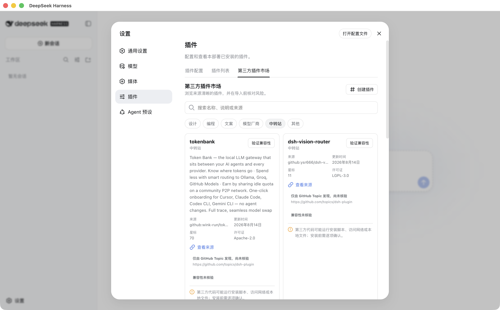

# DeepSeek Harness Desktop

[English](index.md) | 中文



## 你的 agent 应该拥有一个真正的工作区

DeepSeek Harness Desktop 把完整 Harness Web 体验封装进受监管的 macOS 应用。它保留上游 Harness 的插件化架构、模型灵活性、工具执行、会话、审批和沙箱控制，同时加入桌面生命周期、社区发现、可配置媒体生成，以及用户能够清楚理解的版本发布渠道。

## 为跨格式工作而生

代码、研究、写作、图片和视频经常属于同一份交付物。配置你信任的提供方、保留“付费前审批”，当媒体内容能够实质改善结果时，agent 就能选择 `generate_image` 或 `generate_video`。生成产物会展示为专用结果卡片，不会消失在原始工具输出中。

## 按场景扩展，信任信息清晰可见

插件市场会按设计、编程、文案、模型提供方、网关和其他工作流组织社区项目。发现从 [`dsh-plugin`](https://github.com/topics/dsh-plugin) 话题开始。只有在固定提交上的 manifest 与 patch 目标验证通过后，所选仓库才会被标为兼容；兼容不代表已开放安装。当前 Beta 可填写 GitHub、npm 和本地来源草稿以查看风险，但不会执行导入。

## 更新跟随 Release，不跟随噪音

应用检查已签名的 [GitHub Release](https://github.com/KevPH2026/deepseek-harness-desktop/releases)，不会跟随每一次提交。发现新版本时先展示版本说明，下载和安装仍由用户决定。同一个应用菜单还会提供当前版本、更新检查、版本历史、作者信息和反馈入口。

## 从源码 Beta 开始

首个打包目标是 Apple Silicon macOS。在完成 Developer ID 签名与公证版本发布前，可以从源码运行或打包 Beta：

```sh
git clone https://github.com/KevPH2026/deepseek-harness-desktop.git
cd deepseek-harness-desktop
pnpm install
npm run desktop:dev
```

接下来可以阅读 [Web 工作区快速入门](guide/index.md)、[配置模型提供方](guide/providers.md)，或[了解插件如何打包与安装](develop/basic/publish.md)。

## 社区版本，归属清晰

本项目由 [@KevPH2026](https://github.com/KevPH2026) 维护，不是 DeepSeek 官方桌面产品。它基于开源 [DeepSeek Harness](https://github.com/deepseek-ai/deepseek-harness) 项目，并完整保留 DeepSeek 原始版权声明。代码按 [MIT 许可证](../../LICENSE)分发，捆绑依赖的许可证记录在[第三方声明](../../THIRD_PARTY_NOTICES.md)中。
